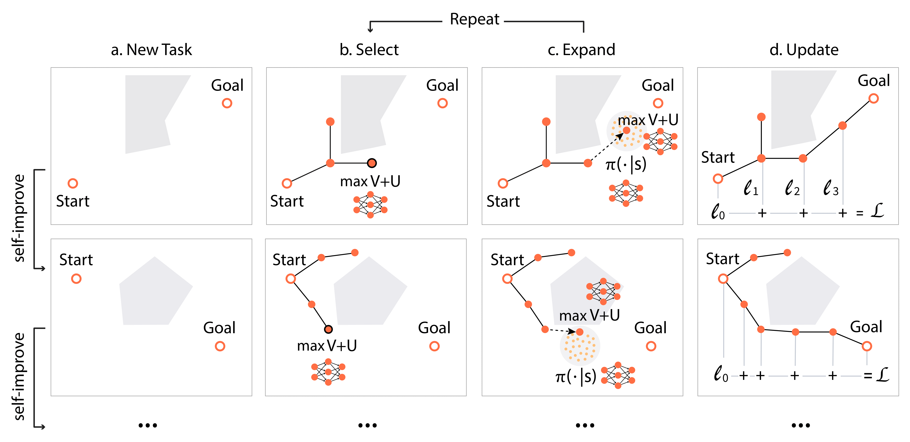

## NEXT Planner

### TL;DR

**What is NEXT:**

NEXT (Neural Exploration-Exploitation Trees) is a sampling-based path planner with learnable components.

**How does NEXT work:**

NEXT employs
1. an attention-based neural module that can learn generalizable structures from prior experiences.
2. a UCB-like component to trade-off exploitation (learned model) and exploration (random sampling).

**How good is NEXT:**

NEXT is 20x more sample efficient than traditional planners.


<!-- NEXT is a meta path planning algorithm which exploits a novel attention-based neural module that can learn generalizable structures from prior experiences to drastically reduce the sample requirement for solving new path planning problems. -->


### Path Planning Problem

The path planning problem is to find a valid path from the robot's initial state to the goal state. It is a fundamental problem with many real-world applications, such as autonomous driving and robot manipulations. The simplest example is to navigate a "dot" robot through a maze (Figure 1). In more complicated problems where the robot is no longer a dot, we need more parameters to describe the robot state (configuration), i.e. the robot's orientation, angles of every joints etc.

|  |
|:--:|
| Figure 1: *"Dot" robot planning* |

For instance, suppose we have a "stick" robot in Figure 2, we need to consider the rotation as an extra dimension of the state. The real state space where we conduct planning is shown in Figure 3, whose information cannot be fully captured by only the workspace map.

|  |  | 
|:--:|:--:|
| Figure 2: *"Stick" robot workspace* | Figure 3: *"Stick" robot state space* |

#### Sampling-based Planners

People resort to sampling-based algorithms for planning in high-dimensional state space. These traditional planners use samples randomly distributed in space to construct a tree whose edges are all valid, and find a path from the initial state to the goal state on the tree. However, they might fail to find a feasible solution in limited time when the space is "narrow" as shown in the "Dot" robot example in Figure 4. 


|  | 
|:--:| 
| Figure 4: *RRT search tree can't find a solution* |


### Learning to Plan with NEXT

Instead of random search, NEXT learns neural priors to guide the tree search. In each iteration of tree expansion, a node is selected based on its value and expanded with its policy, as illustrated in Figure 5. The value and policy are neural priors learned from previous planning experiences. 

|  | 
|:--:| 
| Figure 5: *NEXT workflow* |

We use the "dot" robot planning problem for better illustration below. The learned value and policy are visualized in Figure 6. Assisted with these models, NEXT grows a search tree which successfully finds a feasible solution (Figure 7).

|  |  |
|:--:|:--:|
|Figure 6: *Learned neural priors*|Figure 7: *NEXT search tree*|


#### Search Tree Comparisions

We compare search tree produced by traditional algorithms and NEXT on the same problems below. NEXT produces much smaller and cleaner trees which successfully find the solution.

|  |  |
|:--:|:--:|
| Figure 8: *RRT search tree for stick robot* | Figure 9: *NEXT search tree for stick robot* |

|  |  |
|:--:|:--:|
| Figure 10: *RRT search tree for spacecraft* | Figure 11: *NEXT search tree for spacecraft* |

#### Results


### Demos


<!--
## Welcome to GitHub Pages

You can use the [editor on GitHub](https://github.com/binghong-ml/NEXT-planner/edit/master/index.md) to maintain and preview the content for your website in Markdown files.

Whenever you commit to this repository, GitHub Pages will run [Jekyll](https://jekyllrb.com/) to rebuild the pages in your site, from the content in your Markdown files.

### Markdown

Markdown is a lightweight and easy-to-use syntax for styling your writing. It includes conventions for

```markdown
Syntax highlighted code block

# Header 1
## Header 2
### Header 3

- Bulleted
- List

1. Numbered
2. List

**Bold** and _Italic_ and `Code` text

[Link](url) and 
```

For more details see [GitHub Flavored Markdown](https://guides.github.com/features/mastering-markdown/).

### Jekyll Themes

Your Pages site will use the layout and styles from the Jekyll theme you have selected in your [repository settings](https://github.com/binghong-ml/NEXT-planner/settings). The name of this theme is saved in the Jekyll `_config.yml` configuration file.

### Support or Contact

Having trouble with Pages? Check out our [documentation](https://help.github.com/categories/github-pages-basics/) or [contact support](https://github.com/contact) and we’ll help you sort it out.
-->